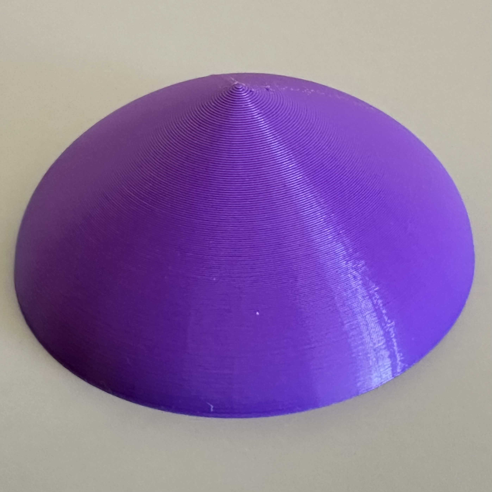

# Calculus 3D Models: Disk and Washer Methods

This repository contains an OpenSCAD file for illustrating the **disk method** and **washer method** for calculating volumes of revolution, commonly taught in calculus courses.

## Mathematical Description

- The solid is generated by revolving a region about the **y-axis**. The region is determined by:
  - `x = f(y)` defines the **outer** boundary of the region.
  - `x = g(y)` defines the **inner** boundary of the region.
  - `y = a` defines the bottom of the region.
  - `y = b` defines the top of the region.
- If you set `g(y) = 0`, the model automatically switches to the **disk method** (solid without holes).

  
  

  
  

## Interactive Previews

- [Disks model](Disks.stl) (preview STL file)
- [Solid for the disks model](DisksSolid.stl) (preview STL file)
- [Washers model](Washers.stl) (preview STL file)
- [Solid for the washers model](WashersSolid.stl) (preview STL file)

## How to Use

- Open the `.scad` file in [OpenSCAD](https://openscad.org/).
- Customize parameters:
  - `n`: Number of subintervals
  - `sample_type`: `"bottom"`, `"mid"`, or `"top"` sampling for the approximation
  - `show_solid`: Toggle between discrete stacked disks/washers or a full continuous solid
  - `printedheight`: Set the final height of the printed object in millimeters
- Render the model.
- Export the model to STL for 3D printing, or use for visualization.

## Files Included

- `DiskAndWashers.scad` — Main customizable OpenSCAD model with disk, washer, and full solid modes.
- `DisksSolid.stl` — STL file of a full solid of revolution for the disk model (smooth continuous surface).
- `Disks.stl` — STL file showing the discrete disk approximation (Riemann-style stacking).
- `WashersSolid.stl` — STL file of a full solid of revolution for the washers model (smooth continuous surface).
- `Washers.stl` — STL file showing the discrete washer approximation (Riemann-style stacking).

## License

This project is licensed under the [Creative Commons Attribution-NonCommercial 4.0 International License](https://creativecommons.org/licenses/by-nc/4.0/).  
Feel free to use, modify, and share for educational or personal use, with attribution. Commercial use is not permitted.

